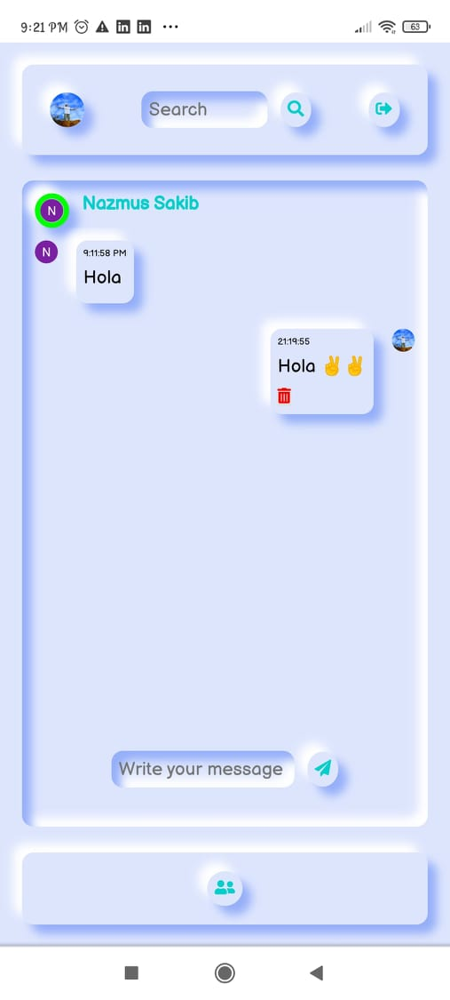
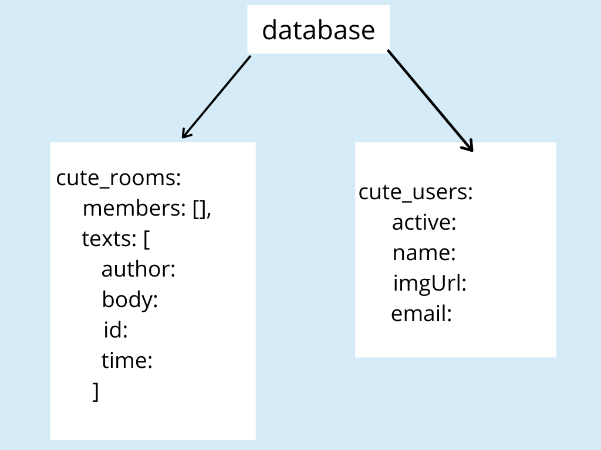

<!-- PROJECT LOGO -->
<br />
<p align="center">

  <h3 align="center">cute-chat</h3>
  <p align="center">
    A Realtime Texting/Chatting App
  </p>
</p>

<!-- TABLE OF CONTENTS -->
<details open="open">
  <summary>Table of Contents</summary>
  <ol>
    <li>
      <a href="#about-the-project">About The Project</a>
      <ul>
        <li><a href="#built-with">Built With</a></li>
      </ul>
    </li>
    <li><a href="#demo">Demo</a></li>
    <li><a href="#database-structure">Database Structure</a></li>
    <li><a href="#features">Features</a></li>
    <li><a href="#future-possible-updates">Future Possible Updates</a></li>
    <li>
      <a href="#getting-started">Getting Started</a>
      <ul>
        <li><a href="#prerequisites">Prerequisites</a></li>
        <li><a href="#installation">Installation</a></li>
      </ul>
    </li>
    <li><a href="#license">License</a></li>
    <li><a href="#contact">Contact</a></li>
  </ol>
</details>

<!-- ABOUT THE PROJECT -->

## About The Project

cute-chat is a realtime chatting app using reactJS and Google's firebase.

## Demo:


### Android Version:



### Built With

- ReactJS
- Firebase
- Firestore
- Javascript
- CSS
- JSS

## Database Structure:



## Features:

1. One to one chat.
2. See the list of acquitances.
3. See the active status of the acquitances.
4. Searching by the exact username.
5. Sign in using google, facebook and any other email account.
6. Neomorphic design.

## Future Possible Updates:

1.  Adding the group facility.
2.  Changing the user profile information.

<!-- GETTING STARTED -->

## Getting Started

To get a local copy up and running follow these simple steps.

### Prerequisites

- NodeJS
- VS Code

### Installation

1. Download VS Code [Here](https://code.visualstudio.com/download)

2. Download the latest version of NodeJS from [Here](https://nodejs.org/en/download/)

3. Open the terminal and check the installation and version

```sh
node --version
```

4. Clone the repo in your local machine and open the project in VS Code.

5. To install the required dependencies use

```sh
npm install
```

6. To run the app in the localhost use

```sh
npm start
```

<!-- LICENSE -->

## License

Distributed under the MIT License. See `LICENSE` for more information.

<!-- CONTACT -->

## Contact

Asif Azad - brainiac2677@gmail.com

Project Link: [https://github.com/BRAINIAC2677/PaFin](https://github.com/BRAINIAC2677/PaFin)
